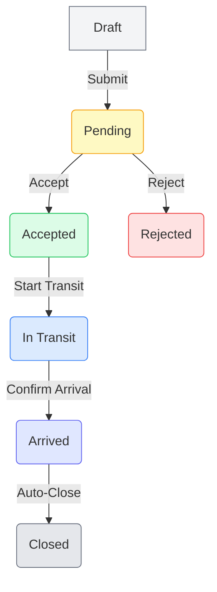

'''
# 📄 توثيق النظام المحدث (B36 v33)

هذا المستند يقدم توثيقاً شاملاً للتحديثات التي تم إجراؤها على نظام إدارة تدفق المرشحين، ويشمل شرحاً للأدوار والصلاحيات، دورة حياة الطلبات (الانتقالات)، ومعايير القبول.

---

## 1. الأدوار والصلاحيات (Roles & Permissions)

تم تطبيق نظام صلاحيات محكم (RBAC) يعتمد على 6 أدوار ثابتة. يتم التحقق من الصلاحيات في الواجهة الأمامية (UI)، منطق التطبيق (Frontend Logic)، وقواعد بيانات Firestore (Backend) لضمان أقصى درجات الأمان (Defense in Depth).

### ملخص الأدوار

| الدور | الوصف | نطاق العمل |
|---|---|---|
| **Admin** | المدير العام | وصول كامل لكل شيء في النظام بدون قيود. |
| **InternalSupervisor** | مشرف المبنى | إدارة كاملة للقاعات والطلبات الداخلية، وإنشاء طلبات التوازن. |
| **InternalUser** | منظم داخلي عادي | قبول ومصادقة الطلبات للقاعات المُعيّن عليها فقط. |
| **ExternalSupervisor** | منظم خارجي مشرف | إدارة العدد الخارجي وإنشاء طلبات النقل من الخارج إلى قاعات الانتظار. |
| **ExternalUser** | منظم خارجي عادي | تحديث العدد الخارجي فقط. |
| **Viewer** | عارض | عرض لوحة التحكم (Dashboard) والإحصائيات فقط (Read-only). |
| **Path Organizer** | منظم المسار | دور خاص يُسند لمستخدم (عادة `InternalUser`) لتنفيذ عمليات النقل الفعلية بين القاعات. |

### مصفوفة الصلاحيات التفصيلية

| الصلاحية | Admin | Internal Supervisor | Internal User | External Supervisor | External User | Viewer | Path Organizer |
|:---|:---:|:---:|:---:|:---:|:---:|:---:|:---:|
| **إدارة الأعداد** | | | | | | | |
| `COMMIT_HALL_COUNT` (اعتماد عدد القاعة) | ✅ | ✅ | للقاعته | ❌ | ❌ | ❌ | ❌ |
| `MANAGE_OUTSIDE_COUNT` (إدارة العدد الخارجي) | ✅ | ❌ | ❌ | ✅ | ✅ | ❌ | ❌ |
| **إنشاء الطلبات** | | | | | | | |
| `CREATE_OUTSIDE_TO_WAITING` | ✅ | ❌ | ❌ | ✅ | ❌ | ❌ | ❌ |
| `CREATE_WAITING_TO_INTERVIEW` | ✅ | ✅ | ❌ | ❌ | ❌ | ❌ | ❌ |
| `CREATE_INTERVIEW_TO_INTERVIEW` | ✅ | ✅ | ❌ | ❌ | ❌ | ❌ | ❌ |
| **إجراءات الطلبات** | | | | | | | |
| `ACCEPT_REJECT_REQUEST` (قبول/رفض) | ✅ | ✅ | للقاعته | ❌ | ❌ | ❌ | ❌ |
| `START_TRANSIT` (بدء النقل) | ✅ | ✅ | ❌ | ❌ | ❌ | ❌ | ✅ |
| `CONFIRM_ARRIVAL` (مصادقة الوصول) | ✅ | ✅ | للقاعته | ❌ | ❌ | ❌ | ❌ |
| `ASSIGN_PATH_ORGANIZER` | ✅ | ✅ | ❌ | ❌ | ❌ | ❌ | ❌ |
| **الإدارة والعرض** | | | | | | | |
| `MANAGE_HALLS` (إدارة القاعات) | ✅ | ✅ | ❌ | ❌ | ❌ | ❌ | ❌ |
| `VIEW_DASHBOARD` (عرض الداشبورد) | ✅ | ✅ | ✅ | ✅ | ✅ | ✅ | ✅ |
| `VIEW_ANALYTICS` (عرض الإحصائيات) | ✅ | ✅ | ❌ | ❌ | ❌ | ✅ | ❌ |
| `VIEW_AUDIT_LOG` (عرض سجل العمليات) | ✅ | ✅ | ❌ | ❌ | ❌ | ❌ | ❌ |

---

## 2. دورة حياة الطلبات (State Transitions)

تم تصميم دورة حياة الطلبات (State Machine) لمنع تضارب الأعداد وضمان تتبع دقيق لكل عملية نقل. **الخصم من المصدر يحدث مرة واحدة فقط عند الانتقال إلى `IN_TRANSIT`**.

### مخطط الانتقالات

### شرح المراحل

| المرحلة | الحالة | الوصف | الإجراء التالي |
|:---|:---|:---|:---|
| 1 | **Draft** | يتم إنشاء الطلب كمسودة. يمكن تعديله وحذفه. | `Submit` (إرسال) |
| 2 | **Pending** | الطلب بانتظار موافقة المستلم (مسؤول القاعة الوجهة). | `Accept` أو `Reject` |
| 3 | **Accepted** | تمت الموافقة على الطلب. بانتظار بدء عملية النقل. | `Start Transit` |
| 4 | **Rejected** | تم رفض الطلب. تعتبر هذه حالة نهائية. | لا يوجد |
| 5 | **In Transit** | **(نقطة الخصم)** يتم الآن نقل المرشحين. يتم خصم `requestedCount` من القاعة المصدر أو العدد الخارجي. | `Confirm Arrival` |
| 6 | **Arrived** | **(نقطة الإضافة)** وصل المرشحون. يتم إضافة `actualArrivedCount` إلى القاعة الوجهة. | `Auto-Close` |
| 7 | **Closed** | اكتملت عملية النقل وتمت المصادقة عليها. تعتبر هذه حالة نهائية. | لا يوجد |

### آلية منع الخصم المزدوج (Double Decrement)

- **عند `Start Transit`**: يتم تنفيذ عملية `increment(-requestedCount)` على القاعة المصدر.
- **عند `Confirm Arrival`**: يتم تنفيذ عملية `increment(actualArrivedCount)` على القاعة الوجهة.
- **لا يوجد أي خصم أو إضافة في أي مرحلة أخرى.** هذا يضمن أن كل مرشح يتم خصمه وإضافته مرة واحدة فقط خلال دورة حياة الطلب.

---

## 3. اختبارات القبول (Acceptance Criteria)

تم تحديد مجموعة من حالات الاختبار لضمان أن النظام يعمل كما هو متوقع ويحقق جميع المتطلبات الأمنية والوظيفية. هذه الاختبارات يجب أن تنجح جميعها قبل اعتماد النظام.

1.  **صلاحيات نطاق القاعة (Hall Scope)**
    - **السيناريو**: `InternalUser` مُعيّن على `Hall A` يحاول قبول طلب موجه إلى `Hall B`.
    - **النتيجة المتوقعة**: يتم رفض العملية مع رسالة خطأ واضحة "ليس لديك صلاحية للتعامل مع هذا الطلب".

2.  **منع الخصم المزدوج**
    - **السيناريو**: إنشاء طلب لنقل 10 مرشحين. يتم قبول الطلب، ثم بدء النقل، ثم مصادقة الوصول.
    - **النتيجة المتوقعة**: يتم خصم 10 من القاعة المصدر **فقط** عند بدء النقل. لا يحدث أي تغيير آخر على عدد القاعة المصدر.

3.  **صلاحيات العارض (Viewer)**
    - **السيناريو**: مستخدم بدور `Viewer` يحاول الوصول إلى رابط مباشر لتعديل قاعة أو طلب (مثلاً: `/halls/edit/hall-1`).
    - **النتيجة المتوقعة**: يتم رفض الوصول على مستوى الـ API (Backend) حتى لو تمكن من رؤية الواجهة.

4.  **اعتماد العدد (Commit Count)**
    - **السيناريو**: `InternalSupervisor` يغير العدد في `Hall C` من 50 إلى 55 باستخدام العداد اليدوي ويضغط "اعتماد".
    - **النتيجة المتوقعة**: يتغير `currentCount` في قاعدة البيانات إلى 55، ويتم إنشاء سجل جديد في `AuditLog` يوثق العملية (قبل: 50، بعد: 55).

5.  **إلزامية التعليق عند وجود فرق (Mismatch)**
    - **السيناريو**: طلب نقل 10 مرشحين، ولكن تم مصادقة وصول 8 فقط. يحاول المستلم تأكيد الوصول بدون كتابة تعليق.
    - **النتيجة المتوقعة**: يتم رفض العملية وتظهر رسالة تطالبه بإدخال تعليق وسبب للفرق.

6.  **ظهور الأسماء في بطاقة الطلب**
    - **السيناريو**: عرض تفاصيل أي طلب نقل.
    - **النتيجة المتوقعة**: يجب أن تظهر أسماء المستخدمين بوضوح في الحقول التالية: `Assigned By`, `Assigned To`, `Path Organizer` (إن وجد), `Accepted By`, `Confirmed By`.

7.  **تجاوز السعة بواسطة المدير**
    - **السيناريو**: `Admin` يحاول اعتماد عدد في قاعة يتجاوز سعتها القصوى.
    - **النتيجة المتوقعة**: تظهر نافذة تطلب منه إدخال سبب إلزامي. بعد إدخال السبب، تتم العملية بنجاح.

8.  **منع تجاوز السعة بواسطة غير المدير**
    - **السيناريو**: `InternalSupervisor` يحاول اعتماد عدد يتجاوز السعة.
    - **النتيجة المتوقعة**: يتم رفض العملية مع رسالة خطأ "لا يمكن تجاوز السعة القصوى".
'''
